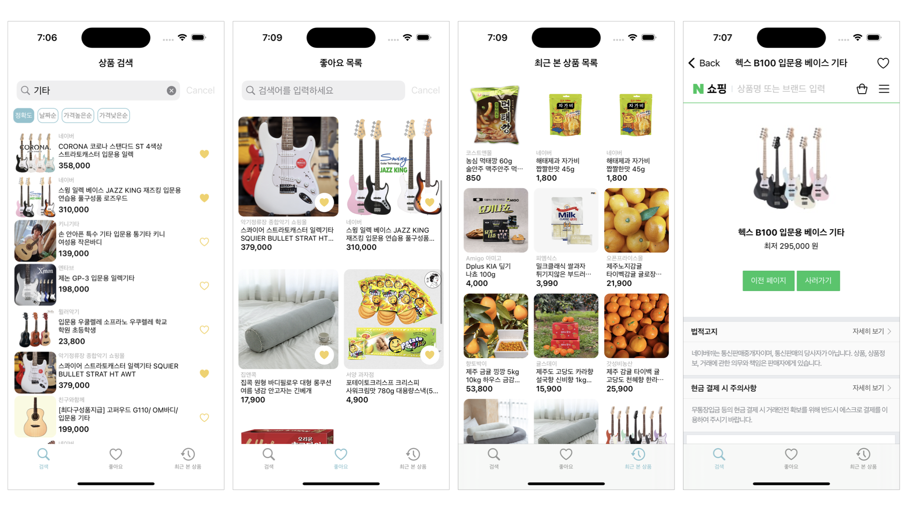

## MyShoppingList - 나의 소중한 쇼핑 목록
<p align="center">
 
</p>

## 앱 소개
 * 원하는 상품을 검색하여 나만의 쇼핑 리스트 만들기
 * 찾는 상품의 키워드를 입력하여 다양한 조건에 따라 정렬하며 검색하기
 * 앱 상에서 네이버 쇼핑 웹사이트로 이동하여 쇼핑 상세 정보 보기 지원
 * 마음에 드는 상품만 체크하여 별도 화면에서 모아 보기 가능
<br/>


## 주요 기능
 * Realm DB를 통해 사용자가 좋아요 버튼을 탭한 상품 관리
 * Alamofire를 사용하여 네이버 검색 API를 통해 쇼핑 리스트 가져오기
 <br/>

## 개발 기간
 * 2023.09.07. ~ 2023.09.11.
<br/>

## 개발환경
  * Xcode 14.3.1
  * Supported Destinations : iPhone
  * Minimum Deployments : 13.0
  * Orientation : Portrait
<br/>


## 사용기술 및 라이브러리
 * UIKit, Snapkit, Realm, Alamofire, MVC
 <br/>
 
## 트러블 슈팅     
 ### 1. 날짜 변화에 따른 FSCalendar UI 업데이트 이슈
   * 오후 11시 59분에서 자정으로 넘어갈 때 오늘 날짜로 표시되는 UI가 변경되지 않는 이슈 발생
   * `viewWillAppear` 메서드에 캘린더 업데이트 구문을 작성하였으나 다른 탭을 선택했다 돌아와도 변경되지 않음
   * NotificationCenter를 통해 날짜 변화 시점을 관찰하여 자정이 될 때 캘린더 UI가 업데이트 되도록 반영

     ```swift
     override func viewDidLoad() {
          super.viewDidLoad()
          NotificationCenter.default.addObserver(self, selector: #selector(updateToday), name: NSNotification.Name.NSCalendarDayChanged, object: nil)
      }
  
       @objc func updateToday() {
          DispatchQueue.main.async {
              self.todoCalendar.today = Date()
              self.todoCalendar.reloadData()
          }
      }
      
       override func viewDidDisappear(_ animated: Bool) {
          super.viewDidDisappear(animated)
          NotificationCenter.default.removeObserver(self)
      }
     ```
   
 ### 2. 포도알 채우는 로직 구현 시 예상보다 많은 고려 사항
   * 화면이 나타날 때 로직 계산을 위해 `viewWillAppear`에 메서드를 작성하였는데, Todo를 모두 완료한 경우 화면을 볼 때마다 포도알이 늘어나는 버그 발생
   * 오늘의 Todo를 모두 완료처리 했다가 사용자가 새로운 할 일을 추가하거나 완료 처리를 취소할 때 채웠던 포도알 스티커를 하나 회수해야 하는 상황 발생
   * 다음과 같은 코드를 통한 예외 처리 구현

     ```swift
      func setNewPodo() {
        guard let todayTodo else { return }
        let validateIsDone = todayTodo.filter { $0.isDone == false }
        let date = Date().addingTimeInterval(-86400).dateToString().stringToDate()
        if currentPodoCount() == 10 && (todayTodo.count == 0 || validateIsDone.isEmpty) {
            if let currentPodo {
                podoRepo.update(id: currentPodo._id, isCurrent: false, fillCount: 10, completeDate: date, plusDate: date, deleteDate: nil)
                podoRepo.create(GrapeList(isCurrent: true, completeDate: nil, plusDate: nil, deleteDate: nil))
            }
            currentPodo = podoRepo.fetchCurrent().first
            podoList = podoRepo.fetch()
         }
       }

     func updatePodo() {
        guard let todayTodo else { return }
        let count = currentPodoCount()
        var changeCount = count
        let today = Date().dateToString().stringToDate()
        let validateIsDone = todayTodo.filter { $0.isDone == false }
        
        guard let currentPodo else {
            return
        }
        
        if validateIsDone.isEmpty && todayTodo.count != 0 {
            if currentPodo.plusDate != today {
                changeCount += 1
                if changeCount > 10 || changeCount > count + 1 {
                    return
                }
                podoRepo.update(id: currentPodo._id, isCurrent: true, fillCount: changeCount, completeDate: nil, plusDate: today, deleteDate: nil)
            }
        } else {
            if currentPodo.deleteDate != today && currentPodo.plusDate == today {
                changeCount -= 1
                if changeCount < 0 || changeCount < count - 1 {
                    return
                }
                podoRepo.update(id: currentPodo._id, isCurrent: true, fillCount: changeCount, completeDate: nil, plusDate: nil, deleteDate: today)
            }
        }
    
     ```

<br/>

## 회고
 * 짧은 기간 안에 네트워크 요청과 데이터베이스를 다루느라 쉽지 않았으나 프로젝트를 끝내니 해당 기능에 대한 이해도가 올라갔다고 느낌
 * 데이터베이스를 각각의 VC에서 선언하는 방법이 아닌 더 효율적인 방법을 찾아 적용했다면 더 좋았을 거라는 아쉬움이 남아 추가 학습할 계획
 * 네트워크 실패 시의 에러 처리를 print로만 처리하였는데 사용자를 위한 처리 방법에 무엇이 있을지 고민하게 됨
